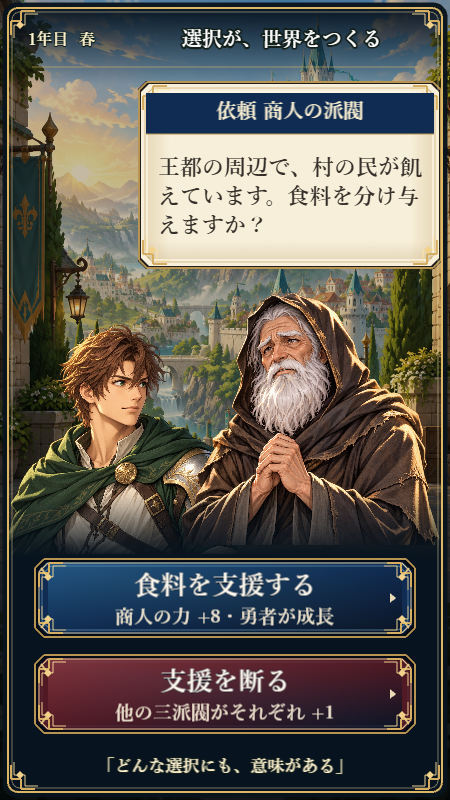

# Karma Quest UIデザイン基準

## 基準と適用範囲

ユーザー指定により、コミット `1f35267` の選択ボタンをUIの造形基準とする。構図・世界観の基準は引き続き[正式モック（写真5）](../review/karma-visual-mock.jpg)。ボタンを起点に、カード・ナビ・HUDへ同じ色、金属枠、文字階層を展開する。まずKarma Questに適用し、他作品へ配色や装飾を一律適用しない。

方向性は「深い色面と細い金属枠を持つ、読みやすい王道ファンタジー」。背景と人物を主役にしつつ、操作面は十分な面積と明暗差を持たせる。大きな丸角、明るいベタ塗り、太い文字縁取り、全面の強い発光は使用しない。

## 色の役割

| トークン | 値 | 用途 |
| --- | --- | --- |
| surface.underlay | `#050B13` | ボタン外縁の暗い下地 |
| action.primary.base | `#102C52` | 支援・次へなど主要操作の紺色 |
| action.primary.light | `#235783` | 紺色の上面光 |
| action.alternative.base | `#501923` | 拒否・対立する選択のえんじ色 |
| action.alternative.light | `#80343D` | えんじ色の上面光 |
| surface.shadow | `#0B1425` | 色面下端の陰影 |
| border.gold | `#B79451` | 外側の金属枠 |
| border.highlight | `#F4DFAA` | 内側の細い光 |
| border.cool | `#6192B4` | 青系操作面の内縁 |
| ornament.gold | `#E8CB83` | 四隅の装飾 |
| text.onDark | `#FFFAF0` | 操作面の文字 |
| text.onPaper | `#35281E` | 羊皮紙上の見出し |
| text.bodyOnPaper | `#43382E` | 羊皮紙上の本文 |
| surface.paper | `#F7EFD9` | 依頼・年代記の情報面 |

青と赤は選択の種類を示し、正解・不正解を意味しない。上昇・低下は矢印と文言も併記し、色だけに依存しない。

## ボタン仕様

以下は450×800の設計座標。CSS表示サイズとは区別する。

| 項目 | 基準 |
| --- | --- |
| 主要な二択 | 幅382、高さ80、縦間隔16 |
| 次へ | 幅328、高さ58 |
| 再出発 | 幅360、高さ72 |
| 形 | 四隅を9px落とした八角形。丸角のカプセル形は使わない |
| 枠 | 外側2px、内側1px。外周から1 / 5 / 8pxに配置 |
| 光 | 左上から右下に暗くなる控えめな陰影。強い白帯は置かない |
| 文字 | 22px、明朝系、太字。濃紺の縁取りは1pxまで |
| 文字領域 | 幅から70pxを除き、装飾と矢印の領域を確保 |
| 右矢印 | 小さな三角形。操作可能な遷移に使用 |
| 入力範囲 | 外接矩形全体。角を落とした部分も押せる |

文言は動詞を含めて短くする。長文はボタンを拡張するか、判断材料を別の説明欄へ置く。文字を縮めて収めない。アイコンは意味を補強できる場合だけ使い、フォント依存の絵文字で代用しない。

## 操作状態

| 状態 | 設計 |
| --- | --- |
| 通常 | 上記の色と金枠 |
| 押下 | 上面光を落として沈んだ印象にする。文字位置と入力範囲は動かさない |
| フォーカス（導入時） | 枠の外側に明るい線を追加し、キーボード操作位置を明示 |
| 無効（導入時） | 彩度と枠の光を下げ、理由を近くに表示。入力を受け付けない |
| 処理中（導入時） | 幅を保ったまま状態文言を表示し、二重実行を防止 |

現実装は通常・押下・矩形入力範囲まで対応。フォーカス、無効、処理中は設計規定であり未実装。現状のpointerdown実行も、将来はpointerup確定とドラッグキャンセルに統一する。

## 他部品への展開

| 部品 | 引き継ぐルール | ボタンとの差 |
| --- | --- | --- |
| 依頼カード | 羊皮紙、暗い見出し帯、細い金枠 | 非操作カードには矢印・押下表現を付けない |
| ナビ | 紺の下地、金の区切り、選択項目の明度差 | 全項目を強いCTAにしない。ラベルを常時表示 |
| HUD | 暗い下地、アイボリー文字、限定的な金枠 | 装飾を減らし数値の読み取りを優先 |
| 結果・成長 | 羊皮紙、行の整列、ラベルと変化量の分離 | 金枠はグループ単位。小さな値ごとに強い装飾を重ねない |

装飾の強さは「主要操作 > 選択中ナビ > 情報カード > 補助情報」。静的な情報面と操作面を同じ外観にしない。

## 文字・余白・画面比率

- 設計上の目安は見出し30–35px、判断用本文18–20px、CTA22px。補助情報を本文より強くしない。
- 実表示で本文14 CSS px、CTA文字16 CSS px、通常タップ44 CSS px、主要CTA52 CSS pxを下回らない。設計pxが大きくてもCanvas縮小後に小さければ不合格。
- 狭い画面では文字を縮めず、短文化・配置変更・補助情報の段階表示を行う。主要操作を画面外へ追い出さない。
- 縦横回転では各レイアウトを組み直す。人物・画像・枠を縦横別倍率で引き延ばさない。
- 依頼画面のプレイヤーは左下の正面バストアップ。老人の顔と依頼カードを重ねず、足元で不自然な遠近を作らない。
- 全画面で装飾を一律拡大せず、文章、人物の顔、主要操作に優先的に面積を割り当てる。

## 実装とレビュー

現在の描画元は `games/karma-quest/src/conceptArt.ts` の `button()`。上記トークン名は設計上の命名で、コードへの定数抽出は未実施。複数ファイルへ展開する際に共通トークンと部品へ切り出す。

変更時は正式モックとスクリーンショットを比較し、①顔や本文への重なり、②実表示サイズでの可読性、③操作面と情報面の区別、④縦横での収まり、⑤タップ位置と状態遷移を確認する。画像スナップショットの更新だけを合格根拠にしない。

今後の適用順は、依頼カード → ホームナビ・HUD → 年代記・結果 → 横画面。今回確定したボタンの造形を基準に段階的に揃える。
